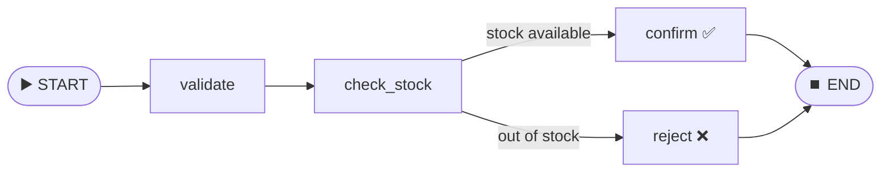

<div align="center">

# 🕸️ LangGraph 101

### A beginner-friendly order-processing workflow built with LangGraph


</div>

---

## ✨ Overview

**LangGraph 101** is a small project that teaches the core building blocks of [LangGraph](https://github.com/langchain-ai/langgraph) through a simple, real-world example: **processing an online order**.

An order flows through a graph where each step is a **node**. The graph validates the order, checks stock, and then **branches** to either confirm or reject it.

No LLM or API key needed. It's pure graph logic, which makes it a good first step before building AI agents. 🚀

---

## 🧠 Concepts Covered

| Concept | Where to find it | What it does |
|---|---|---|
| **State** | `app/state.py` | A shared `TypedDict` that carries data between nodes |
| **Nodes** | `app/nodes.py` | Plain Python functions that read and update the state |
| **Conditional Edges** | `app/edges.py` | A router function that decides which node runs next |
| **Graph Wiring** | `app/graph.py` | Connects nodes and edges, then compiles the workflow |
| **Execution** | `app/main.py` | Invokes the graph with an order and prints the final state |

---

## 🔀 Workflow



**Step by step:**

1. **`validate`** checks that the product name exists and the quantity is greater than 0.
2. **`check_stock`** looks the product up in a fake inventory.
3. **`stock_router`** sends the order to `confirm` if stock is enough, otherwise to `reject`.
4. **`confirm` / `reject`** sets the final `status` to `CONFIRMED` or `REJECTED`.

---

## 📦 Shared State

```python
class OrderState(TypedDict):
    product: str
    quantity: int
    is_valid: bool
    stock_available: bool
    status: str
```

Every node receives this state, updates it, and passes it on to the next node.

---

## 🗂️ Project Structure

```
Langgraph_101/
├── app/
│   ├── __init__.py
│   ├── state.py        # 📋 OrderState definition
│   ├── nodes.py        # ⚙️ validate, check_stock, confirm, reject
│   ├── edges.py        # 🔀 stock_router (conditional logic)
│   ├── graph.py        # 🕸️ builds and compiles the graph
│   └── main.py         # ▶️ entry point
├── src/langgraph_101/  # uv package scaffold
├── requirements.txt
├── pyproject.toml
└── README.md
```

---

## 🚀 Getting Started

### 1️⃣ Clone the repository

```bash
git clone https://github.com/<your-username>/Langgraph_101.git
cd Langgraph_101
```

### 2️⃣ Create a virtual environment

```bash
python -m venv .venv

# Windows
.venv\Scripts\activate

# macOS / Linux
source .venv/bin/activate
```

### 3️⃣ Install dependencies

```bash
pip install -r requirements.txt
```

> 💡 Requires **Python 3.12+**.

### 4️⃣ Run the project

```bash
python -m app.main
```

---

## 🖥️ Sample Output

```text
Validate order
Product:  laptop
Quantity:  2
Validation o/p:  True
Checking stock
--------------------
Product:  laptop
Requested:  2
Available:  5
Stock available:  True
Confirm order
Order confirmed for2 laptop(s)
FINAL STATE
====================
{'product': 'laptop', 'quantity': 2, 'is_valid': True, 'stock_available': True, 'status': 'CONFIRMED'}
```

---

## 🧪 Try It Yourself

Open `app/main.py` and change the order:

```python
order = {
    "product": "laptop",
    "quantity": 50,      # 👈 more than available stock
    "is_valid": False,
    "stock_available": False,
    "status": "",
}
```

Run it again and watch the graph take the **`reject`** path. ❌

**Fake inventory** (in `app/nodes.py`):

| Product | Stock |
|---|---|
| 💻 laptop | 5 |
| ⌨️ keyboard | 10 |
| 🔌 wires | 20 |

---

## 🛣️ Roadmap

- [ ] Route invalid orders (`is_valid = False`) straight to `reject`
- [ ] Visualize the graph with `graph.get_graph().draw_mermaid()`
- [ ] Add an LLM node (e.g., to parse free-text orders)
- [ ] Add human-in-the-loop approval for large orders
- [ ] Add unit tests for each node

---

## 🛠️ Tech Stack

- 🐍 **Python 3.12**
- 🕸️ **LangGraph**: workflow / state-machine orchestration
- 📦 **uv / pip**: dependency management

---

## 👤 Author

**Atharv**
B.Tech in Computer Science & Design

⭐ If this helped you learn LangGraph, consider giving the repo a star!
